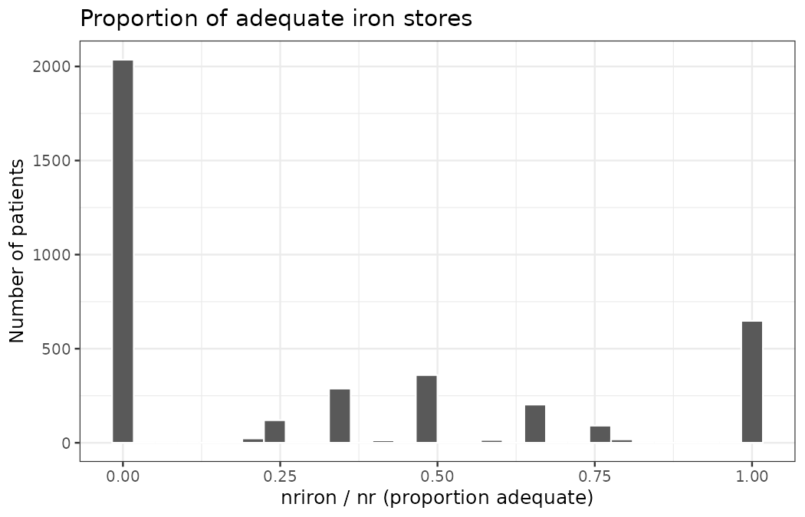
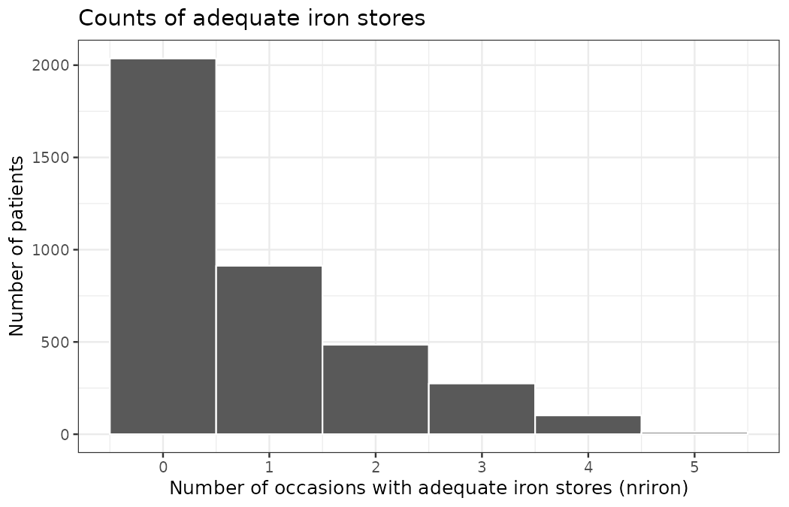

# Hemodialysis Mixture Analysis

## Data and outcome
- Source: `hemodialysismix.csv` (patients on hemodialysis)
- Response: `NRIRON` = number of occasions with adequate iron stores
- Trials: `NR` = number of measurements per subject
- Covariates: `AGE` (years), `SEX` (1=Male, 2=Female, NA kept as Unknown)

## Descriptive overview
- N subjects: 3823
- Distribution of follow-up counts NR:
# A tibble: 6 × 2
     NR     n
  <int> <int>
1     1   880
2     2   828
3     3  1180
4     4   780
5     5   127
6     6    28
- `SEX` counts:
# A tibble: 3 × 2
  SEX_factor     n
  <fct>      <int>
1 Male        1952
2 Female      1732
3 Unknown      139
- Proportion of adequate iron p = NRIRON/NR:
   Min. 1st Qu.  Median    Mean 3rd Qu.    Max. 
 0.0000  0.0000  0.0000  0.3118  0.6667  1.0000 

Figures:
- 
- 

## Dispersion assessment
- Intercept-only binomial GLM Pearson dispersion phi = 1.643 (>1 indicates overdispersion)
- GLM with AGE and SEX (with missingness indicator) phi = 1.644
- Evidence of overdispersion relative to simple binomial.
- Overdispersion persists even after adjusting for AGE/SEX.

## Finite mixture of Binomials
- Selected mixture size by BIC (custom EM): k = 3
- Estimated component probabilities (p) and weights (pi):
  component          p        pi
1         1 0.02563364 0.4132071
2         2 0.37836314 0.4082093
3         3 0.84203424 0.1785835

Figures:
- 
- 
- 

## Relation to AGE and SEX
- Spearman correlation p_hat~AGE p-value: 0.155
- Kruskal-Wallis p_hat by SEX p-value: 0.411
- Multinomial logit (component ~ AGE + SEX) p-values (rows: components vs ref):
  (Intercept) AGE_imp AGE_miss SEX_factorFemale SEX_factorUnknown
2           0  0.0799      NaN           0.2247            0.2149
3           0  0.5000      NaN           0.8934            0.4678
  SEX_factorOther
2             NaN
3             NaN

## Do covariates fully explain clusters?
- Concomitant BIC not computed (using custom EM without concomitants).
- Residual overdispersion after GLM suggests clusters beyond AGE/SEX.

## Software and estimation
- R, glm (binomial), flexmix (finite mixture EM)
- NAs were retained: `SEX` as explicit 'Unknown' level; `AGE` imputed with mean plus a missingness indicator to keep subjects in all analyses.

## Communication-ready takeaway
- We modeled the number of months with adequate iron stores out of total measurements per patient.
- The simple binomial model showed 
overdispersion, indicating subgroups with different iron adequacy probabilities.
- A 3-component mixture captured heterogeneity with component p's around 0.03, 0.38, 0.84 and weights 0.41, 0.41, 0.18.
- Age and sex show 
limited association.

(See notebook `main.ipynb` for full reproducible analysis and figures.)
